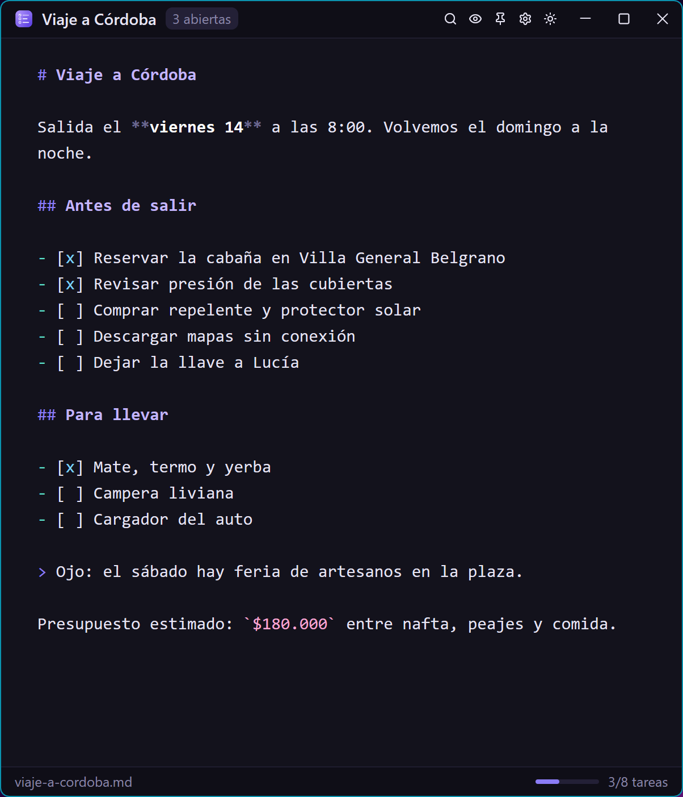
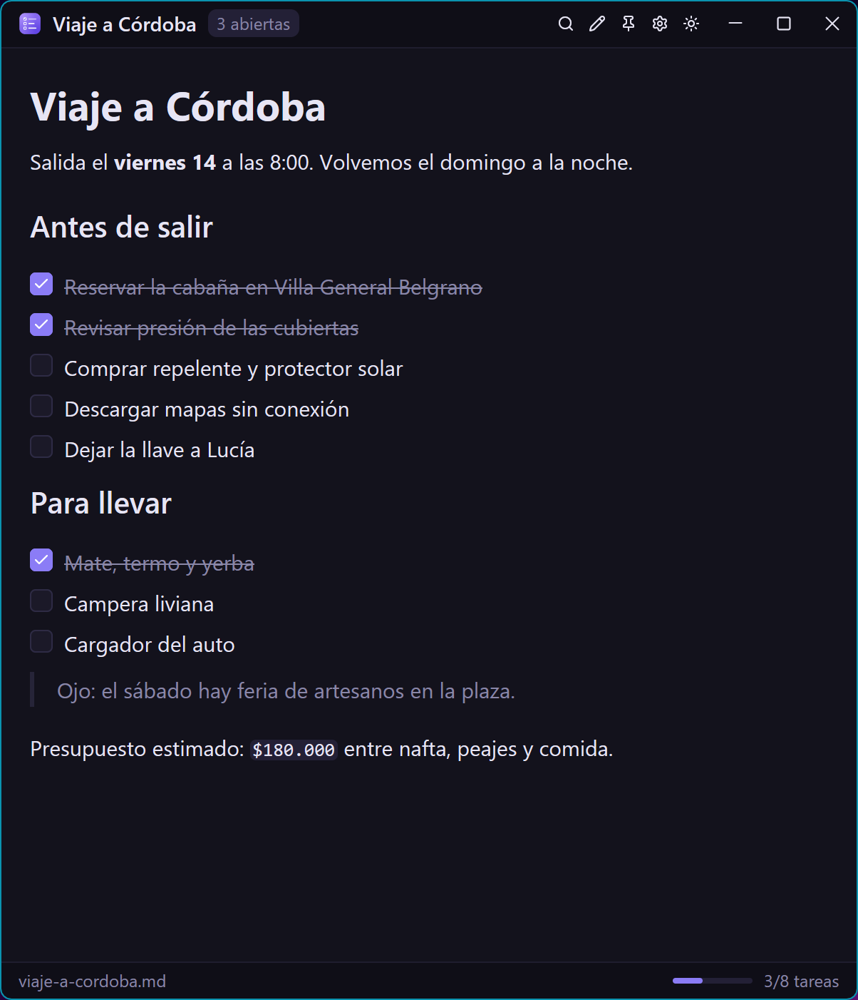
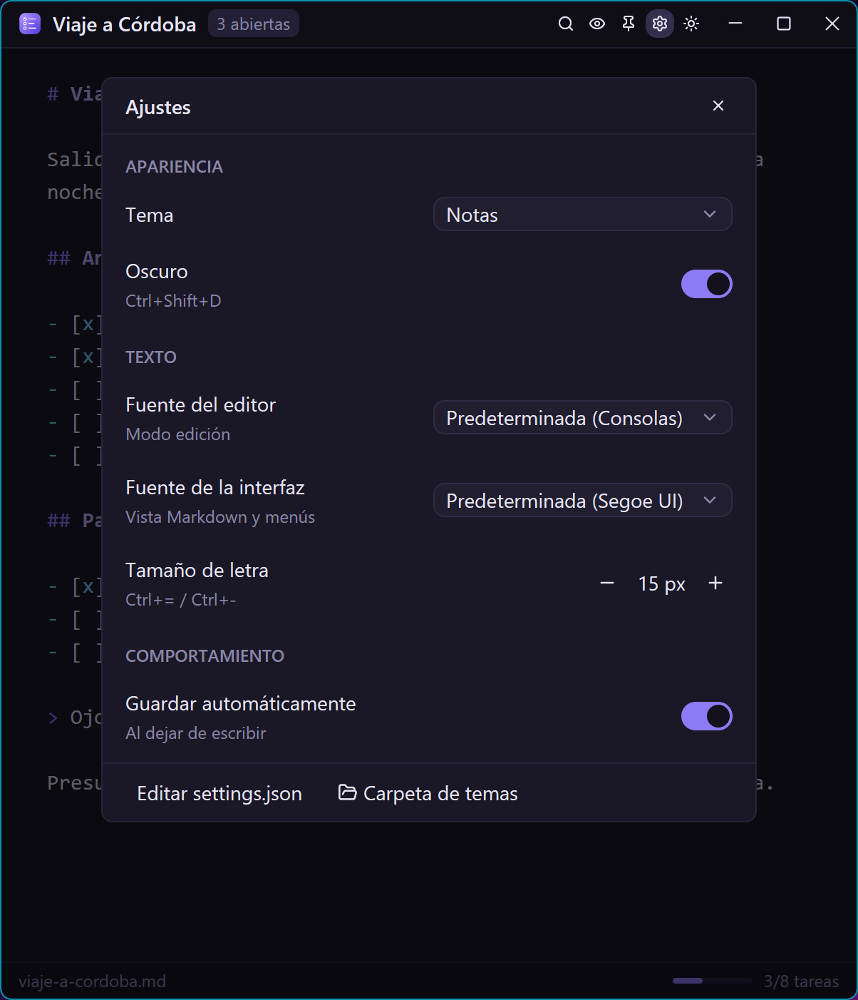
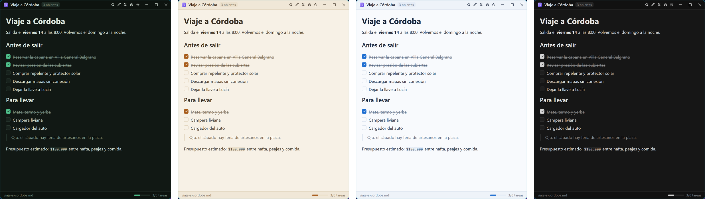

<p align="center">
  
</p>

<h1 align="center">Notas</h1>

<p align="center">
  Bloc de notas minimalista para Windows, con Markdown y listas de tareas.<br>
  Hecho en Rust con <a href="https://gpui.rs">GPUI</a> (vía <a href="https://gpui-kit.com">gpui-kit</a>).
</p>

<p align="center">
  
  
  
</p>

## Qué hace

- **Edición** con resaltado de Markdown y **vista** renderizada (`Ctrl+E`) donde las tareas se marcan con un clic.
- `Ctrl+L` convierte la línea en tarea o la marca. La barra de estado muestra el progreso.
- Varias notas abiertas y un buscador (`Ctrl+K`) por título y contenido. Si lo que escribes no existe, crea la nota.
- Autoguardado al dejar de escribir. Las notas se guardan en `Documentos\Notas`.
- **Ajustes** (`Ctrl+,`): tema, modo claro u oscuro, fuentes, tamaño de letra y "siempre encima". Los cambios se aplican al momento.
- Cinco temas incluidos (Notas, Bosque, Océano, Sepia y Grafito) y soporte para temas propios.

<p align="center">
  
</p>

## Atajos

| Atajo | Acción | Atajo | Acción |
| --- | --- | --- | --- |
| `Ctrl+N` | Nueva nota | `Ctrl+E` | Edición / vista |
| `Ctrl+K` | Buscar notas | `Ctrl+L` | Crear / marcar tarea |
| `Ctrl+O` | Abrir archivo | `Ctrl+Shift+D` | Claro / oscuro |
| `Ctrl+S` | Guardar | `Ctrl+Shift+T` | Siempre encima |
| `Ctrl+W` | Cerrar nota | `Ctrl+=` `Ctrl+-` | Tamaño de letra |
| `Ctrl+,` | Ajustes | `Ctrl+Shift+K` | Editar atajos |

Los atajos se cambian en `%APPDATA%\Notas\keymap.json`, por ejemplo `{ "alt-p": "TogglePin", "ctrl-shift-t": null }`.

## Personalizar

- **Ajustes:** se guardan en `%APPDATA%\Notas\settings.json`. Puedes editarlo desde el panel y se aplica al guardar.
- **Temas propios:** copia uno de [`assets/themes`](assets/themes) a `%APPDATA%\Notas\themes\`. El panel tiene un botón que abre esa carpeta. Cambia el `name` y los colores; el tema aparece la próxima vez que abras el panel.

## Compilar

Necesitas Rust (MSVC) y Visual Studio Build Tools con "Desarrollo para el escritorio con C++".

```bash
cargo build --release
```

El ejecutable queda en `target\release\notas.exe`. Para usarlo como bloc de notas predeterminado: clic derecho en un `.md` o `.txt`, luego *Abrir con* → `notas.exe` → *Siempre*.
